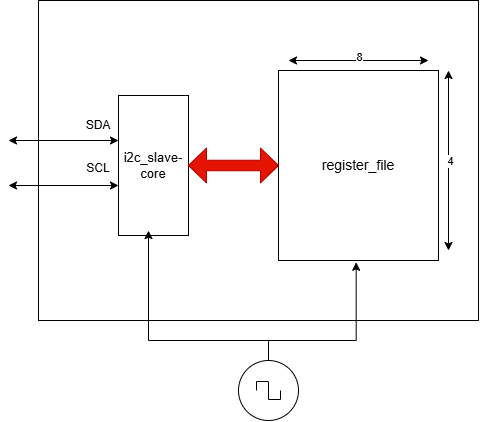
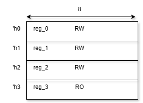
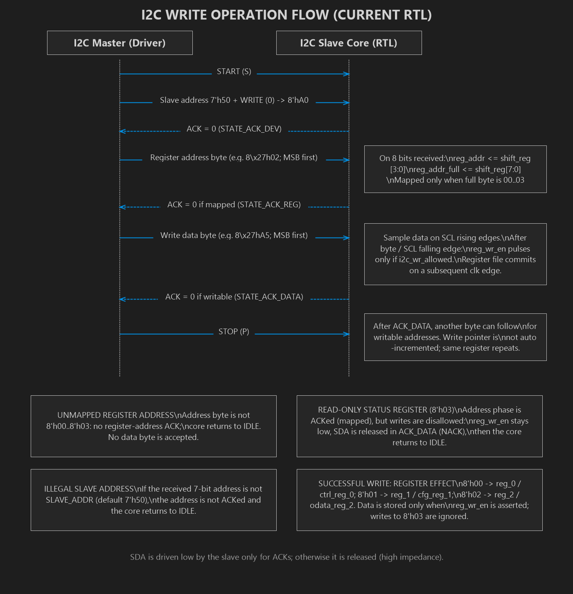
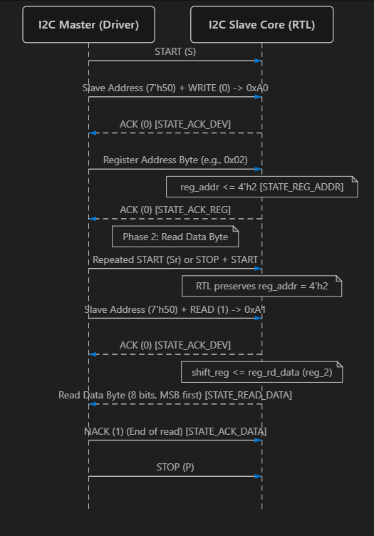

# I2C Peripheral RTL Specification

## 1. Overview

This RTL block implements a compact I2C slave peripheral intended to appear as a 7-bit address slave at `0x50` on the I2C bus. It supports byte-oriented register access and provides a small register map for control, configuration, output data, and read-only status.

The design is split into three main RTL blocks:

- `i2c_peripheral_top`: top-level module exposing the external bus and application-facing register ports.
- `i2c_slave_core`: protocol state machine that detects bus conditions, captures address/data bits, drives acknowledgements, and performs serial transmit/receive operations.
- `register_file`: register storage and read/write decode logic.

The design is intended for use in an embedded peripheral or simple control interface, with support for normal I2C master read/write traffic and robust handling of illegal or unmapped accesses.

---

## 2. Block-Level Architecture



*Figure 2-1. Top-level I2C peripheral architecture and register-file connection.*

### 2.1 Top-Level Module

File: `verification/RTL/i2c_peripheral_top.v`

```verilog
module i2c_peripheral_top #(
    parameter [6:0] SLAVE_ADDR = 7'h50
)(
    input  wire       clk,
    input  wire       rst_n,
    input  wire       scl,
    inout  wire       sda,
    output wire [7:0] ctrl_reg_0,
    output wire [7:0] cfg_reg_1,
    output wire [7:0] odata_reg_2,
    input  wire [7:0] idata_reg_3_status
);
```

#### External interface

- `clk`: system clock used for all internal sampling and synchronous logic.
- `rst_n`: active-low reset.
- `scl`: I2C serial clock line.
- `sda`: bidirectional I2C data line.
- `ctrl_reg_0`, `cfg_reg_1`, `odata_reg_2`: writable peripheral registers exposed to the rest of the system.
- `idata_reg_3_status`: input status value, exposed as read-only register `0x3`.

### 2.2 Core Protocol Engine

File: `verification/RTL/i2c_slave_core.v`

This module implements the actual I2C slave state machine. It monitors the bus for:

- START conditions
- STOP conditions
- SCL rising and falling edges
- SDA transitions while SCL is high/low

It captures incoming serial bits, compares the slave address, handles the read/write bit, manages ACK/NACK signaling, and serializes read data back to the master.

### 2.3 Register File

File: `verification/RTL/register_file.v`

This module stores the peripheral registers and provides the decode logic for:

- register address mapping
- write acceptance
- read data multiplexing
- invalid address handling

---

## 3. Functional Features

### 3.1 Supported I2C Slave Address

The peripheral is configured with a fixed slave address:

- Default: `7'h50`
- Parameter: `SLAVE_ADDR`

The core checks the 7-bit slave address field against this constant after receiving 8 bits of address information.

If the address matches, the slave continues the transaction. If it does not match, the device does not acknowledge the access and returns to idle.

### 3.2 Register Map

The design supports a 4-bit internal register address space, but only the lower four addresses are mapped for the peripheral register bank.

| Register Address | Full 8-bit Value | Name | Direction | Description |
|---|---:|---|---|---|
| `0x0` | `8'h00` | `reg_0` / `ctrl_reg_0` | RW | Control register |
| `0x1` | `8'h01` | `reg_1` / `cfg_reg_1` | RW | Configuration register |
| `0x2` | `8'h02` | `reg_2` / `odata_reg_2` | RW | Output data register |
| `0x3` | `8'h03` | `reg_3_status` | RO | Status input register |

#### Mapped address decode

The design defines `i2c_addr_mapped` as true for the following full 8-bit address values:

- `8'h00`
- `8'h01`
- `8'h02`
- `8'h03`

Any other value is treated as unmapped.

#### Write permission decode

The design defines `i2c_wr_allowed` as true only for addresses:

- `4'h0`
- `4'h1`
- `4'h2`

This means:

- `0x0`, `0x1`, and `0x2` can be written
- `0x3` is read-only and must ignore write attempts
- any higher unmapped address is ignored

### 3.3 Read/Write Access Behavior

The slave supports the conventional I2C transaction patterns:

1. Write register value:
   - START
   - device address + write bit
   - register address
   - data byte
   - STOP

2. Read register value:
   - START
   - device address + write bit
   - register address
   - repeated START
   - device address + read bit
   - data byte returned by slave
   - optional NACK/ACK from master
   - STOP

The design also preserves the current register pointer across START conditions, which allows repeated register access patterns and repeated start transactions without resetting the register address automatically.

### 3.4 Acknowledge Generation

The design actively drives the SDA line to generate ACK/NACK conditions:

- `STATE_ACK_DEV`: after receiving device address, the slave drives SDA low to ACK the address byte.
- `STATE_ACK_REG`: if the register address is mapped, the slave drives SDA low to ACK the register address; otherwise it goes idle.
- `STATE_ACK_DATA`: after write or read transfer, the slave either drives SDA low to ACK the data phase or releases SDA for a NACK/idle transition depending on the bus condition and selected behavior.

This ensures protocol compliance for both read and write phases.

### 3.5 SDA Bus Control

The interface uses tri-state control on `sda`:

```verilog
assign sda = sda_oe ? sda_out : 1'bz;
```

This allows the peripheral to:

- release the bus when it is not driving
- drive the bus only when it is actively ACKing or outputting a read byte
- coexist correctly with a shared I2C bus line

### 3.6 Reset Behavior

On `rst_n = 0` the design resets all major state and control elements:

- `state <= STATE_IDLE`
- `bit_cnt <= 0`
- `shift_reg <= 0`
- `reg_addr <= 0`
- `reg_addr_full <= 0`
- `rw_bit <= 0`
- `sda_out <= 1`
- `sda_oe <= 0`
- `reg_wr_en <= 0`

The register file also resets:

- `reg_0 = 0`
- `reg_1 = 0`
- `reg_2 = 0`
- `reg_3_status_reg = 0`

This ensures the peripheral starts in a known default condition and does not hold stale data after reset.

---

## 4. Internal Protocol Handling

### 4.1 Meta-Stability Filtering

The core uses a two-stage synchronizer for both `scl` and `sda`:

```verilog
always @(posedge clk or negedge rst_n) begin
    if (!rst_n) begin
        scl_r0 <= 1'b1; scl_r1 <= 1'b1;
        sda_r0 <= 1'b1; sda_r1 <= 1'b1;
    end else begin
        scl_r0 <= scl;    scl_r1 <= scl_r0;
        sda_r0 <= sda;    sda_r1 <= sda_r0;
    end
end
```

This helps reduce the effect of asynchronous sampling and produces filtered versions used by the protocol state machine.

### 4.2 Bus Condition Detection

The block derives the following signals:

- `start_cond = (sda_r1 && !sda_r0) && scl_r1`
- `stop_cond  = (!sda_r1 && sda_r0) && scl_r1`
- `scl_pos    = (scl_r0 && !scl_r1)`
- `scl_neg    = (!scl_r0 && scl_r1)`

These are used to determine:

- beginning of an I2C transaction
- end of a transaction
- rising/falling edges of SCL for bit sampling

### 4.3 State Machine Overview

The protocol engine uses the following states:

| State | Description |
|---|---|
| `STATE_IDLE` | Waiting for a START condition |
| `STATE_DEV_ADDR` | Receive and decode the 8-bit slave address |
| `STATE_ACK_DEV` | Acknowledge the device address |
| `STATE_REG_ADDR` | Receive the target register address |
| `STATE_ACK_REG` | Acknowledge the register address |
| `STATE_WRITE_DATA` | Receive a write data byte from master |
| `STATE_READ_DATA` | Shift out data to master |
| `STATE_ACK_DATA` | Handle final ACK/NACK for data phase |

#### State behavior summary

- `STATE_DEV_ADDR`: shift in incoming bits and check whether the slave address matches.
- `STATE_ACK_DEV`: generate ACK if right address; choose read vs write direction based on `rw_bit`.
- `STATE_REG_ADDR`: collect the register address and store it into `reg_addr` and `reg_addr_full`.
- `STATE_ACK_REG`: gate access based on whether the register address is in the mapped range.
- `STATE_WRITE_DATA`: receive data byte; when all 8 bits are received, pulse `reg_wr_en` if write is allowed.
- `STATE_READ_DATA`: shift out serial data to the bus, one bit per SCL falling edge.
- `STATE_ACK_DATA`: determine whether to continue a read or allow the next write operation.

---

## 5. Register File Semantics



*Figure 5-1. Register-file map showing the 8-bit register width and access permissions.*

### 5.1 Write Behavior

The `register_file` module contains synchronous writes triggered by the pulse `i2c_wr_en`:

```verilog
always @(posedge clk or negedge rst_n) begin
    if (!rst_n) begin
        reg_0 <= 8'h00;
        reg_1 <= 8'h00;
        reg_2 <= 8'h00;
        reg_3_status_reg <= 8'h00;
    end else if (i2c_wr_en) begin
        case (i2c_addr)
            4'h0: reg_0 <= i2c_wr_data;
            4'h1: reg_1 <= i2c_wr_data;
            4'h2: reg_2 <= i2c_wr_data;
            default: ;
        endcase
    end
end
```

This means:

- writes to `0x0`, `0x1`, and `0x2` update the corresponding register
- writes to `0x3` are ignored
- writes to unmapped addresses are ignored

### 5.2 Read Behavior

The value returned to the I2C engine is selected by a combinational mux:

```verilog
always @(*) begin
    case (i2c_addr)
        4'h0: i2c_rd_data = reg_0;
        4'h1: i2c_rd_data = reg_1;
        4'h2: i2c_rd_data = reg_2;
        4'h3: i2c_rd_data = reg_3_status;
        default: i2c_rd_data = 8'h00;
    endcase
end
```

Hence:

- `0x0`, `0x1`, and `0x2` return the current register values
- `0x3` returns the current status input value
- invalid addresses return `8'h00`

### 5.3 Read-Only Status Register

The register at address `0x3` is intended to reflect an external hardware status input:

```verilog
input wire [DATA_WIDTH-1:0] reg_3_status
```

The logic does not allow software writes to this register. It is writable only by the external environment, not by the I2C interface.

---

## 6. Illegal and Unmapped Access Handling

### 6.1 Illegal Slave Address

The slave checks the device address against the fixed `SLAVE_ADDR` constant. If the address does not match, the state machine transitions back to `STATE_IDLE` and does not continue with address or data phase processing.

This behavior is explicitly validated in the UVM testbench using illegal-slave transactions.

### 6.2 Unmapped Register Addresses

If the full 8-bit register address is not one of the valid mapped values, the following occurs:

- `reg_addr_mapped` is false
- `STATE_ACK_REG` is not allowed to continue
- the state machine returns to `IDLE`
- the register file returns `8'h00` on read to unmapped addresses
- writes are ignored

This makes the peripheral robust to erroneous and out-of-range register requests.

### 6.3 Read-Only Register Writes

The design prevents writes to `0x3` using the `i2c_wr_allowed` decode and the `case` statement in the register file. Any attempt to write `0x3` is ignored.

This is consistent with an external status register that should not be modified over I2C.

---

## 7. Timing and Bus-Level Behavior

### 7.1 Clock Relationship

The design does not use a dedicated I2C clock generation block. Instead, it synchronizes to the external master clock and samples `scl` and `sda` on the system clock (`clk`). This is typical for a simple peripheral implementation and is valid when the clock is sufficiently fast relative to the I2C bus speed.

### 7.2 Bit Sampling

Most bus monitoring is based on SCL edges:

- `scl_pos` indicates a rising edge of SCL
- `scl_neg` indicates a falling edge of SCL

Incoming bits are captured on `scl_pos` (data is sampled on rising edges of SCL), while outgoing bits are driven on falling edges of SCL according to the read-state logic.

### 7.3 Control of bus release and drive

The peripheral drives `sda` only when required:

- ACK generation
- serial read output during read transactions
- otherwise release the line via `sda_oe = 1'b0`

This satisfies the open-drain/open-collector behavior expected from I2C.

---

## 8. Verification-Oriented Features

Although the RTL itself is the implementation, the project’s UVM verification environment validates the key protocol behaviors. The following scenarios are explicitly represented in the testbench suite:

- simple read and write accesses to valid registers
- read-only register validation
- illegal slave address rejection
- unmapped register access handling
- reset while the bus is active
- address and data coverage sampling

The verification environment monitors:

- START/STOP conditions
- ACK/NACK responses
- slave address matching
- register access validity
- reset state recovery

This design is therefore not only a functional module, but also a verification target for protocol correctness.

For the detailed UVM environment architecture, sequence/test hierarchy, checking, coverage, assertions, reset behavior, and run scripts, see the [I2C Peripheral UVM Testbench Documentation](../documnents/UVM_Testbench_Documentation.md).


*Figure 8-1. Inheritance tree for the base and specialized UVM sequences.*


*Figure 8-2. Inheritance tree for the UVM tests and sequence type overrides selected by each derived test.*

---

## 9. Example Transaction Flow

### 9.1 Writing to `ctrl_reg_0`

Example transaction:

1. Master sends `START`
2. Master sends device address `7'h50` with `R/W = 0`
3. Slave responds with ACK
4. Master sends register address `8'h00`
5. Slave responds with ACK
6. Master sends data byte `8'hA5`
7. Slave responds with ACK
8. Master sends `STOP`

Result:

- `reg_0` becomes `8'hA5`



*Figure 9-1. I2C write operation flow.*

### 9.2 Reading from `cfg_reg_1`

Example transaction:

1. Master sends `START`
2. Master sends `7'h50` with `R/W = 0`
3. Slave acknowledges
4. Master sends register address `8'h01`
5. Slave acknowledges
6. Master sends `REPEATED START`
7. Master sends `7'h50` with `R/W = 1`
8. Slave acknowledges
9. Peripheral drives `reg_1` value on `sda`
10. Master sends ACK/NACK
11. Master sends `STOP`

Result:

- value in `reg_1` is returned serially to the master



*Figure 9-2. I2C read operation flow.*

---

## 10. Functional Summary

This I2C peripheral is a small but complete slave implementation with these core capabilities:

- fixed 7-bit I2C slave address support (`0x50`)
- byte-based register addressing and data transfer
- 4 mapped 8-bit registers: `0x0`, `0x1`, `0x2`, `0x3`
- read/write arbitration and illegal access rejection
- robust reset and bus-state handling
- ACK/NACK management for valid and invalid transactions
- tri-state SDA control for I2C compliance
- support for simple read/write and repeated-start transfer patterns

This module is well suited for low-complexity embedded control interfaces and has clear validation coverage for legal/illegal transaction behavior.
