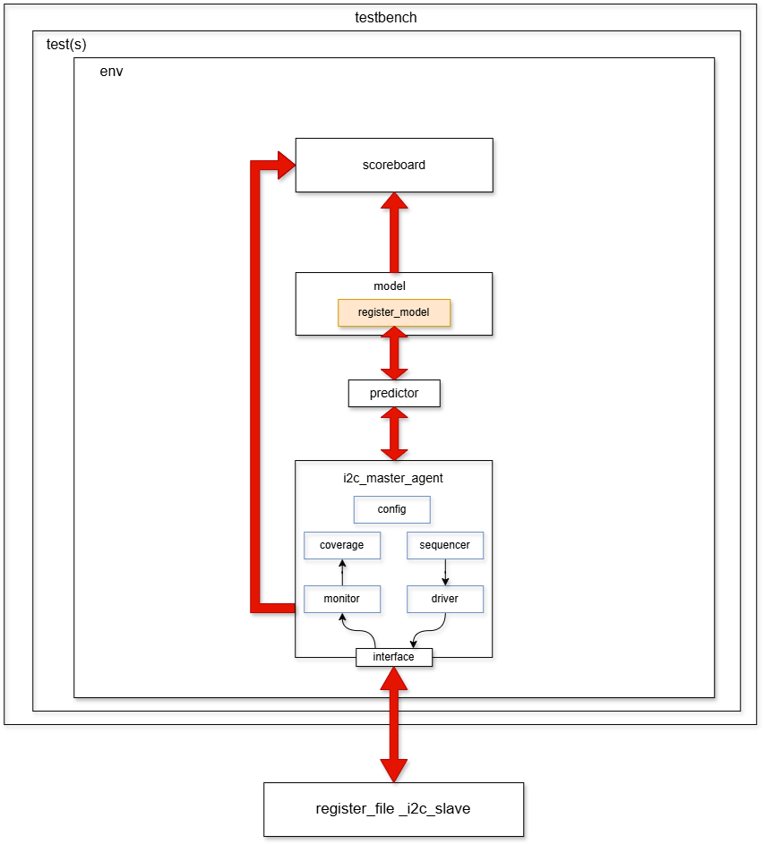
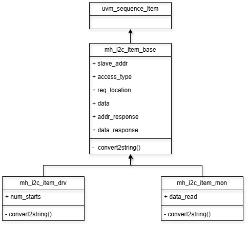
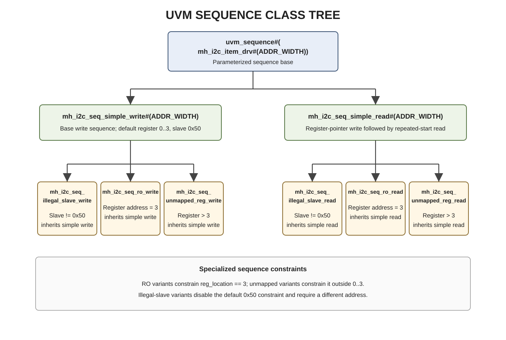
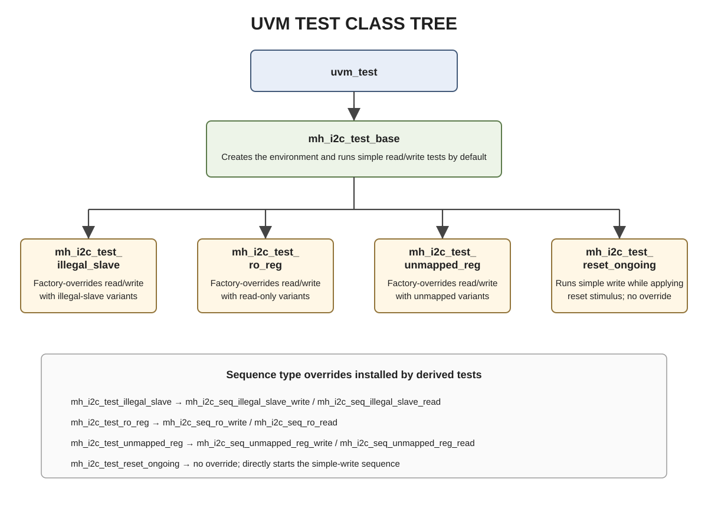

# I2C Peripheral UVM Testbench Documentation

## 1. Purpose and Scope

This document describes the SystemVerilog/UVM verification environment used to exercise the I2C peripheral RTL. It explains the testbench hierarchy, transaction objects, sequence and test classes, active master agent, bus monitor, register model, predictor, scoreboard, functional coverage, assertions, reset handling, and QuestaSim run scripts.

The testbench drives the peripheral as an I2C master and observes the shared bus. The DUT itself is the slave. The current environment is centered on protocol behavior and expected ACK/NACK responses; see [Known Limitations](#17-known-limitations-and-implementation-notes) for checks that are not currently implemented.

### Related specification

The hardware implementation and register behavior are described in the [I2C Peripheral RTL Specification](../RTL/I2C_Peripheral_RTL_Specification.md).

A separate verification plan has also been prepared. It documents the design requirements and the corresponding verification requirements used to plan and assess this testbench's verification activities.

---

## 2. Verification Environment at a Glance

The UVM environment is instantiated by the HDL top-level `testbench` module. Its central components and transaction flow are:

1. A selected UVM test creates `mh_i2c_env`.
2. The environment creates the master agent, reference register model, predictor, and scoreboard.
3. A sequence produces `mh_i2c_item_drv` requests for the sequencer.
4. The driver translates each request to SCL/SDA activity through the virtual interface.
5. The monitor reconstructs observed bus activity as `mh_i2c_item_mon` transactions.
6. Analysis connections send observed items to the reference model, predictor, scoreboard, and coverage component.
7. The reference model predicts address/data ACK/NACK responses; the scoreboard compares the predicted responses with the monitor observations.



*Figure 2-1. Testbench, environment, master agent, register model, predictor, scoreboard, interface, and DUT relationship.*

The main source files are:

| Area | Source files |
|---|---|
| HDL top and interface | `testbench.sv`, `mh_i2c_intf.sv` |
| Packages and shared types | `mh_i2c_test_pkg.sv`, `mh_i2c_pkg.sv`, `mh_i2c_agent_master_pkg.sv`, `i2c_agent_master_types.sv`, `mh_i2c_defines.sv` |
| Agent | `mh_i2c_agent_master.sv`, `mh_i2c_agent_master_config.sv`, `mh_i2c_sequencer.sv`, `mh_i2c_driver.sv`, `mh_i2c_monitor.sv`, `mh_i2c_coverage.sv` |
| Transactions and sequences | `mh_i2c_item_base.sv`, `mh_i2c_item_drv.sv`, `mh_i2c_item_mon.sv`, `mh_i2c_seq_*.sv` |
| Environment and checking | `mh_i2c_env.sv`, `mh_i2c_model.sv`, `mh_i2c_predictor.sv`, `mh_i2c_scoreboard.sv`, `mh_i2c_adapter.sv` |
| Register model | `mh_i2c_reg_model_pkg.sv`, `mh_i2c_reg_block.sv`, `mh_i2c_reg_file.sv`, `mh_i2c_reg.sv`, `mh_i2c_reg_3_status.sv` |
| Tests | `mh_i2c_test_base.sv`, `mh_i2c_test_illegal_slave.sv`, `mh_i2c_test_ro_reg.sv`, `mh_i2c_test_unmapped_reg.sv`, `mh_i2c_test_reset_ongoing.sv` |
| Simulation scripts | `verification/sim/run.do`, `verification/sim/run_unmapped_reg.do` |

---

## 3. HDL Top-Level and Virtual Interface

### 3.1 `testbench` module

`verification/testbench/testbench.sv` provides the non-UVM simulation boundary:

- Generates `clk` by toggling every `#5` time units (10 time-unit period; the source comment calls this 10 ns).
- Initializes `scl` and `sda` high and applies an active-low reset pulse: reset is asserted after 6 time units, held low for 30, then released.
- Instantiates `mh_i2c_intf` and connects its reset, SCL, and SDA signals to the DUT.
- Instantiates `i2c_peripheral_top` with `SLAVE_ADDR=7'h50`.
- Publishes the interface as a virtual interface at `uvm_test_top.env.agent_master` through `uvm_config_db`.
- Installs `mh_i2c_test_error_catcher`, then calls `run_test("")`. A plusarg such as `+UVM_TESTNAME=mh_i2c_test_ro_reg` selects a named test.
- Exposes the package error-seen flag as `uvm_error_seen` for the Questa suite script.

The DUT's application register ports are not connected in this top-level instance. The current UVM environment therefore verifies bus transactions and response behavior; it does not directly compare the external `ctrl_reg_0`, `cfg_reg_1`, or `odata_reg_2` outputs against expected values.

### 3.2 `mh_i2c_intf`

The interface contains:

- `clk`, `reset_n`, `scl`, and `sda` signals used by the driver and DUT.
- `sda_wand`, a wired-AND observation net used to sample the resolved bus value.
- `has_checks`, initialized to 1.
- `sample_start`, which waits for SDA to fall while SCL is high.
- START/STOP sequences and SVA properties.

The interface is passed to UVM as `i2c_vif`, a typedef for `virtual mh_i2c_intf`.

### 3.3 I2C response encoding

The shared types define:

```systemverilog
typedef enum bit {I2C_ACK, I2C_NACK} i2c_response;
typedef enum bit {I2C_WRITE, I2C_READ} i2c_access_type;
```

The enum encodings correspond to the sampled bus bit: `I2C_ACK` is 0 and `I2C_NACK` is 1. `I2C_WRITE` is 0 and `I2C_READ` is 1.

---

## 4. UVM Hierarchy and Connectivity

### 4.1 Environment (`mh_i2c_env`)

The environment creates:

- `agent_master`: parameterized active I2C master agent.
- `model`: expected response model and UVM register block owner.
- `predictor`: converts observed monitor transactions into UVM register prediction updates.
- `scoreboard`: compares actual and expected ACK/NACK responses.

The environment connects monitor analysis ports to the model, predictor, scoreboard, and agent coverage component. It also forwards the driver-reported data item size to the monitor and model.

### 4.2 Master agent (`mh_i2c_agent_master`)

The agent creates `agent_config`, `sequencer`, `driver`, and `monitor`. With the default `UVM_ACTIVE` setting it also creates the sequencer and driver. The monitor is always created; coverage is created when enabled.

Connections made in `connect_phase`:

- Driver sequence-item port -> sequencer export.
- Monitor address and data analysis ports -> coverage inputs.
- Driver data-queue size analysis port -> monitor and reference model.
- Virtual interface is retrieved from `uvm_config_db` and stored in `agent_config`.

The current default agent is active, so it both drives and monitors the bus.

### 4.3 Agent configuration

`mh_i2c_agent_master_config` holds the virtual interface, active/passive mode, timing values, and coverage/check enable flags. Defaults are:

| Configuration | Default |
|---|---:|
| Agent mode | `UVM_ACTIVE` |
| SCL high duration | 4000 |
| SCL low duration | 4700 |
| SDA setup duration | 250 |
| SDA hold duration | 300 |
| Bus-free duration | 4700 |
| Coverage enabled | 1 |
| Checks enabled | 1 |

Timing values use the simulator's applicable time unit. The driver currently uses the high, setup, hold, and bus-free values; the low-period value is stored and exposed by the config class but is not used by the driver tasks.

---

## 5. Transaction Objects

The transaction inheritance diagram shows the common fields and the extensions used by driver and monitor items.



*Figure 5-1. Common sequence-item base and driver/monitor specializations.*

### 5.1 `mh_i2c_item_base#(ADDR_WIDTH)`

The base item extends `uvm_sequence_item` and carries:

| Field | Meaning |
|---|---|
| `slave_addr` | 7-bit I2C target address; soft default is `7'h50`. |
| `access_type` | `I2C_WRITE` or `I2C_READ`. |
| `reg_location` | Register address field. |
| `data[$]` | Queue of 8-bit transaction bytes. |
| `addr_response` | Address-phase response observed on SDA. |
| `data_response` | Data/register-phase response observed on SDA. |

`convert2string()` formats the fields for transaction logging.

### 5.2 `mh_i2c_item_drv#(ADDR_WIDTH)`

The driver item extends the base and adds `num_starts`, controlling the requested START/repeated-START structure. Soft constraints allow one to five bytes and default `data[0]` to a mapped register range (`0..3`). Individual sequences apply tighter constraints.

### 5.3 `mh_i2c_item_mon#(ADDR_WIDTH)`

The monitor item extends the base with `data_read`, the byte sampled from the slave during a read. The monitor fills its fields from the bus; it is not the driver request object.

---

## 6. Sequencer and Bus Driver

### 6.1 Sequencer

`mh_i2c_sequencer#(ADDR_WIDTH)` is a typed `uvm_sequencer` for `mh_i2c_item_drv`. It also implements the reset callback interface. On reset, it stops active sequences, drops outstanding test objections if needed, and restarts the phase sequence.

### 6.2 Driver behavior

The driver gets the virtual interface through the agent configuration and translates sequence items into I2C bus actions. The core tasks are:

- `drive_start()` / `drive_stop()`: create START and STOP by changing SDA while SCL is high.
- `drive_bit()` / `drive_byte()`: drive individual bits and bytes, MSB first.
- `sample_bit()`: releases SDA, clocks the bus, and samples the resolved `sda_wand` value for ACK/NACK or read data.
- `drive_transaction()`: sends address, transfers requested bytes, samples responses, and controls STOP/repeated START handling.

For a write item, each queued byte is driven MSB first and followed by a sampled response. A NACK leads the driver to issue STOP and return. For a read item, the driver samples eight bits from the slave and then drives the controller response specified by `data_response`; NACK is followed by STOP.

When fetching each item, the driver reports `item.data.size()` through `port_out_size`. This size tells the monitor how many data-phase bytes to collect, including the register-address byte placed at `data[0]` by the write-oriented sequences.

### 6.3 Reset interruption

The driver stores the running transaction process. When reset handling is called, it kills that process and clears the handle. Its `run_phase` waits for reset release before starting transaction driving.

---

## 7. Bus Monitor

The monitor passively detects and reconstructs bus transactions:

1. Waits for SDA falling while SCL is high (START).
2. Samples the 7-bit slave address and R/W bit, then samples and publishes the address response.
3. If the address is NACKed, looks for STOP and ends that transaction.
4. For writes, samples the configured number of bytes. The first byte is recorded as `reg_location`; subsequent bytes are appended to `data`. It samples the response after each byte and publishes the item on the data analysis port.
5. For reads, samples an 8-bit `data_read`, samples the master's ACK/NACK response, and publishes the item.
6. After a completed byte or read response, races STOP detection against repeated START detection. It continues collection after a repeated START.

Bits are sampled on SCL rising edges, with the configured high-period midpoint used for sampling. The monitor's collection process is killed on reset and restarted once reset is released.

### Analysis outputs

- `port_out_addr`: address item event; consumed by the model, scoreboard, and coverage.
- `port_out_data`: data-phase item event; consumed by the model, predictor, scoreboard, and coverage.

---

## 8. Sequences and Test Classes

### 8.1 Sequence class tree



*Figure 8-1. Base simple read/write sequences and their specialized variants.*

Base sequences:

- `mh_i2c_seq_simple_write`: defaults to a legal slave (`0x50`) and mapped register (`0..3`); emits one write item with two bytes. `data[0]` is the selected register address; `data[1]` is not constrained by the sequence and is randomized.
- `mh_i2c_seq_simple_read`: emits a register-pointer write item with repeated-START intent, followed by a read item. The pointer byte is the first item; the second item requests one read byte and sets the controller response to NACK.

There is no payload-value restriction on bytes written by the master agent in the current simple-write sequence. The data type is 8 bits, and `data[1]` is not assigned a fixed value or narrowed by a constraint, so it may randomize to any value from `8'h00` through `8'hFF`. The only address constraint is that the first byte identifies a mapped register (`0..3`). The example `data[1]` constraint in the sequence source is commented out.

Specialized sequences derive from the corresponding base sequence:

| Specialized sequence | Constraint change |
|---|---|
| `mh_i2c_seq_illegal_slave_write` / `_read` | Disables the default slave-address constraint and requires an address other than `7'h50`. |
| `mh_i2c_seq_ro_write` / `_read` | Disables the mapped-register default constraint and forces `reg_location == 3`. |
| `mh_i2c_seq_unmapped_reg_write` / `_read` | Disables the mapped-register default constraint and selects an address outside `0..3`. |

### 8.2 Test class tree



*Figure 8-2. UVM test inheritance and the test-specific sequence type overrides.*

### 8.3 Test behavior

| UVM test name | Parent | Behavior |
|---|---|---|
| `mh_i2c_test_base` | `uvm_test` | Creates the environment, waits 200 time units, then runs 20 simple writes and 20 simple reads in alternating order. Waits another 1000 time units before dropping its objection. |
| `mh_i2c_test_illegal_slave` | `mh_i2c_test_base` | Factory-overrides both simple read and simple write sequence types with their illegal-slave variants. |
| `mh_i2c_test_ro_reg` | `mh_i2c_test_base` | Factory-overrides both simple sequence types with variants targeting register 3. |
| `mh_i2c_test_unmapped_reg` | `mh_i2c_test_base` | Factory-overrides both simple sequence types with variants targeting addresses outside `0..3`. |
| `mh_i2c_test_reset_ongoing` | `mh_i2c_test_base` | Runs a simple write concurrently with reset stimulus. It detects a START, waits a randomized 10..26 SCL positive edges, then asserts reset for 30 time units and releases it. |

The derived tests generally rely on factory type overrides: the inherited base test still creates the simple sequence type, while UVM substitutes the specialized type at creation time.

---

## 9. Reference Register Model and Predictor

### 9.1 Register model

`mh_i2c_model` builds and locks `mh_i2c_reg_block`. The block contains a 1-byte-wide, little-endian, non-byte-addressed map starting at offset zero. The register file maps:

| Offset | Register model object | Width | Access |
|---:|---|---:|---|
| 0 | `I2C_REG_0` | 8 bits | RW |
| 1 | `I2C_REG_1` | 8 bits | RW |
| 2 | `I2C_REG_2` | 8 bits | RW |
| 3 | `STATUS_REG` | 8 bits | RO |

The RW registers reset to zero and have one 8-bit `RW` field. The status register has one 8-bit `RO` field and reset value zero. The model also stores the expected slave address `7'h50`.

### 9.2 Expected-response model

On each observed address, the model predicts ACK if the target address matches a configured slave address; otherwise it predicts NACK.

For data-phase responses, it looks up the register offset:

- Unknown offset -> expected NACK.
- Write to a read-only register once a payload byte is present -> expected NACK.
- Read data response -> expected NACK for the single-byte read pattern (the master terminates the read with NACK).
- Other mapped write/register-address phases -> expected ACK.

The model receives the driver-reported item size so it can distinguish the initial register-address byte from a subsequent write payload when checking a read-only write attempt.

### 9.3 Predictor and adapter

`mh_i2c_predictor` extends `uvm_reg_predictor`. It uses monitor data items and the register map to update the UVM register model based on observed bus traffic:

- For a write item, it records the register address in the adapter and only passes the transaction to the base predictor after a payload byte has been observed; the initial address byte is not treated as register write data.
- For a read item, it passes the observed transaction to the base predictor.

`mh_i2c_reg_adapter.bus2reg()` translates a monitored transaction to a UVM register operation, including address, direction, data, and ACK-derived status. `reg2bus()` is currently a TODO, so this adapter does not currently support initiating bus accesses from UVM RAL sequences.

### 9.4 Read payload check against the mirrored register

Read payloads returned by the RTL are checked against the UVM register model's mirrored value through the passive predictor path:

1. The master agent writes a randomized 8-bit payload to a register.
2. The monitor observes the write payload. `mh_i2c_predictor` skips the register-address phase and sends the payload transaction through the base `uvm_reg_predictor`.
3. `mh_i2c_reg_adapter.bus2reg()` converts that observed payload into a register write operation. The predictor updates the addressed RAL mirror from the value observed on the bus.
4. On a later read, the monitor captures the byte returned by the RTL in `item.data_read`. `bus2reg()` translates that observed byte to a register read operation at the remembered address.
5. The register map has `set_check_on_read(1)`. The UVM register predictor compares the observed read value with the register's existing mirrored value before updating the mirror from the observed read.

A mismatch in the returned read payload therefore triggers the UVM register-model read check. This checks readback against the value learned from the preceding bus-observed write; it is distinct from the response-only address/data ACK scoreboard described below. In this version, the write payload is randomized over the full 8-bit range rather than restricted to selected patterns.

---

## 10. Scoreboard and Error Reporting

The explicit `mh_i2c_scoreboard` compares expected and observed address/data ACK/NACK response enums; it does not maintain independent expected/actual payload queues. Read payload comparison is instead performed by the UVM register predictor's check-on-read path described in Section 9.4.

- Expected address responses arrive from the model and are placed in `exp_addr_resp`.
- Monitor address items are checked against the next expected address response.
- Expected data responses arrive from the model and are placed in `exp_data_resp`.
- Monitor data items are checked against the next expected data response.
- A mismatch is reported with `uvm_error`.

The top-level testbench installs `mh_i2c_test_error_catcher`. The catcher sets `mh_i2c_test_error_seen` when a UVM error is reported, then returns `THROW` so the report remains visible. The Questa suite script examines the exposed `uvm_error_seen` wire after each test and stops on an error.

---

## 11. Functional Coverage

`mh_i2c_coverage` samples transactions published by the monitor. Coverage is enabled by default in the master-agent configuration.

### Address covergroup

| Coverpoint | Coverage intent |
|---|---|
| Access type | Read vs write address phase. |
| Slave address | Legal address `7'h50` and two illegal ranges below/above it. |
| Address response | ACK vs NACK. |
| Access type x address response | Response behavior for reads and writes. |

### Data covergroup

| Coverpoint/cross | Coverage intent |
|---|---|
| Register location | Mapped offsets `0..3` vs unmapped offsets `4` and above. |
| Access type | Read vs write data access. |
| Data response | ACK vs NACK response. |
| Access type x response | Access/response behavior; read+ACK is explicitly ignored. |
| Access type x register | Read/write attempts by mapped/unmapped register class. |

### Reset covergroup

The reset covergroup samples the coverage component's `start` flag during reset handling. The flag is set on observed address events and cleared on observed data events, providing a coarse indicator of reset during an active access. It is not a detailed reset-state or recovery-interval measurement.

### Current functional coverage result

The checked-in merged report in [`verification/sim/coverage/merged_coverage_report.txt`](../sim/coverage/merged_coverage_report.txt) reports **100.00% functional covergroup coverage**: all 3 covergroups and all 35 covergroup bins are covered (0 missed bins). This is the functional coverage result only; the same report's overall filtered instance coverage is **93.43%**, since that aggregate also includes code and assertion/directive coverage. The report is generated by `run.do` after all tests pass.

---

## 12. Reset Handling

Reset support is coordinated through `mh_i2c_reset_handler`, an interface class implemented by components requiring reset callbacks.

- Agent configuration waits for `reset_n` assertion and deassertion.
- The agent calls `handle_reset()` on children implementing the reset-handler interface.
- The sequencer stops active sequences and adjusts outstanding objections.
- The driver kills an in-progress bus-driving process.
- The monitor kills its in-progress collection process.
- The environment forwards reset handling to the reference model.
- The model resets its UVM register block with `"HARD"`.
- Coverage samples its reset-on-going covergroup from its reset callback.

After reset release, the driver and monitor resume their run-phase loops and wait for new bus activity.

---

## 13. Interface Assertions

`mh_i2c_intf` defines START and STOP sequences and includes two assertions, disabled while reset is active or checks are disabled:

1. **Data validity:** after a START, SDA should remain stable while SCL is high until a STOP or another START. Violation reports: `SDA changed while SCL was HIGH during transaction!`
2. **START eventually followed by STOP:** a detected START must eventually be followed by STOP. Violation reports: `Start condition detected but no Stop condition followed!`

Both properties also have corresponding cover properties. They are added to the Questa wave display by the run scripts.

---

## 14. Simulation Flow

### 14.1 Full suite: `verification/sim/run.do`

Run from the `verification/sim` directory in QuestaSim:

```tcl
do run.do
```

The script:

1. Deletes/recreates the `work` library.
2. Compiles RTL with branch, condition, expression, statement, FSM, and toggle coverage instrumentation (`-cover bcesft`).
3. Resolves `UVM_HOME` from the environment or uses its configured fallback, then maps the precompiled Questa UVM library.
4. Compiles the testbench.
5. Runs `mh_i2c_test_base`, `mh_i2c_test_unmapped_reg`, `mh_i2c_test_illegal_slave`, `mh_i2c_test_ro_reg`, and `mh_i2c_test_reset_ongoing`.
6. Saves per-test UCDB files, stops the suite if the exposed UVM error flag is set, and merges/reports coverage only if all tests pass.

Coverage outputs are written under `verification/sim/coverage`, including `merged_coverage.ucdb` and `merged_coverage_report.txt`.

Each `vsim` invocation uses `-sv_seed random`. Questa chooses a random simulator seed for each test invocation, so sequence randomization can produce new stimulus on each run. A random seed does not mathematically guarantee a different sequence on every run; record the seed reported by the simulator when a run needs to be reproduced.

### 14.2 Single-test script

`verification/sim/run_unmapped_reg.do` compiles and runs a single test without coverage instrumentation. Despite its filename and header comment, the current `+UVM_TESTNAME` in the script is `mh_i2c_test_reset_ongoing`; adjust that value if the intended run is the unmapped-register test.

### 14.3 Selecting a test manually

The HDL top calls `run_test("")`, so the selected test can be supplied by the usual UVM plusarg:

```text
+UVM_TESTNAME=mh_i2c_test_base
```

The test name must be registered in `mh_i2c_test_pkg`.

---

## 15. Reading Logs and Debugging

Useful UVM messages include:

- `DRIVER`: transaction start, address, data bytes, sampled ACK/NACK, and STOP handling.
- `MONITOR`: detected START/STOP, reconstructed address/data, and repeated-START handling.
- `ADAPTER`: translated register address and access kind.
- `DEBUG`: test start/end and virtual-interface setup.
- `SCOREBOARD`: response mismatch details.

For wave-level debug, inspect:

- `i2c_intf.scl`, `i2c_intf.sda`, and `i2c_intf.sda_wand`
- `dut` pins and reset
- monitor/driver state and analysis activity
- `assert_data_validity` and `assert_start_eventually_stop`

---

## 16. Bugs Found and Resolved

The following RTL defects were exposed during directed and regression test runs. Each was corrected, and the current RTL has been updated to address them:

1. **Slave address sampled incorrectly after repeated START:** following a repeated-START condition, the slave did not reliably sample the subsequent address byte correctly.
2. **Read-only register write was not rejected:** attempting to write the read-only status register did not produce the expected NACK from the slave.
3. **Late NACK on writes to unmapped registers:** an access to an unmapped register location could be ACKed through the register-address phase, then NACKed only after the first write-payload byte.
4. **Address low hexadecimal digit `3` triggered the same late-NACK behavior:** regression testing after the unmapped-register fix found that register-location values whose least-significant hexadecimal digit was `3` could exhibit the same late NACK on the first write-payload byte.

These issues were found through testbench runs and regression testing, then fixed in the RTL. They are recorded here as resolved issues; they are not known outstanding RTL defects in the current version.

---
